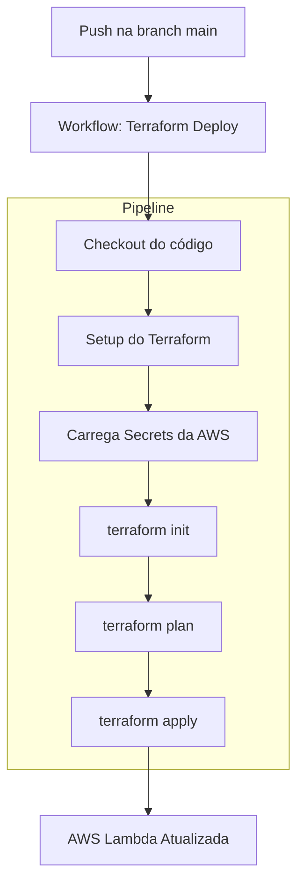

# FIAP Tech Challenge

Este é o repositório que contém códigos Terraform para gerenciar infraestrutura na nuvem da aplicação [Lanchonete App](https://github.com/ns-fiap-tc/tech_challenge_fiap). Nele, você encontrará arquivos de configuração do Terraform que definem a infraestrutura que serve como base para a aplicação e outros recursos.

## Passos para o provisionamento
> Para completo funcionamento da plataforma, é necessário seguir o seguinte fluxo de provisionamento:
> 1. A provisão deste repositório; [infra-base](https://github.com/ns-fiap-tc/infra-base)
> 2. A provisão do repositório do banco de dados: [infra-bd](https://github.com/ns-fiap-tc/infra-bd);
> 3. A provisão da aplicação principal e mock de pagamento em [tech_challenge_fiap](https://github.com/ns-fiap-tc/tech_challenge_fiap).
> 4. A provisão deste repositório: [lambda](#como-rodar-o-projeto);


## 🚀 Como rodar o projeto

### 🤖 Via GitHub Actions
<details>
  <summary>Passo a passo</summary>

#### 📖 Resumo
Este repositório possui uma pipeline automatizada chamada `Terraform Deploy` que permite provisionar a infraestrutura de uma **AWS Lambda responsável por validar o CPF dos clientes e emitir o JWT de autenticação** sempre que houver um push na branch `main`.

A branch é protegida e só aceita alterações que venham de PRs previamente aprovadas.

> ⚠️ Apenas usuários com acesso ao repositório e às **GitHub Secrets** corretas conseguem utilizar esse fluxo.

#### 🔐 Pré-requisitos
Certifique-se de que as seguintes **secrets** estejam configuradas no repositório do GitHub (`Settings > Secrets and variables > Actions`):
- `AWS_ACCESS_KEY_ID`
- `AWS_SECRET_ACCESS_KEY`
- `AWS_SESSION_TOKEN` *(se estiver usando AWS Academy)*

Essas variáveis são utilizadas pelo Terraform para autenticação e execução dos planos na AWS.

#### ⚙️ Etapas da pipeline `Terraform Deploy`
1. 🧾 **Checkout do código**: A action clona este repositório.
2. ⚒️ **Setup do Terraform**: Instala a ferramenta na máquina runner.
3. 📂 **Acesso ao diretório atual**: Todos os arquivos `.tf` são lidos da raiz do repositório.
4. 🔐 **Carregamento das variáveis sensíveis** via secrets.
5. 🧪 **Execução do `terraform init`**: Inicializa o backend e os providers.
6. 🚀 **Execução do `terraform apply`**: A função é criada ou atualizada com base no código referenciado.

#### 🧭 Diagrama do fluxo



#### Benefícios desse fluxo
- ⚡ Deploy automatizado da função Lambda
- ✅ Redução de erros manuais
- 🔐 Segurança no uso de credenciais via GitHub Secrets
- 🔁 Reprodutibilidade garantida

</details>

### 💻 Localmente

<details>
  <summary>Passo a passo</summary>

#### Pré-requisitos

Antes de começar, certifique-se de ter os seguintes itens instalados e configurados em seu ambiente:

1. **Terraform**: A ferramenta que permite definir, visualizar e implantar a infraestrutura de nuvem.
2. **AWS CLI**: A interface de linha de comando da AWS.
3. **Credenciais AWS válidas**: Você precisará de uma chave de acesso e uma chave secreta para autenticar com a AWS (no momento, o repositório usa chaves e credenciais fornecidas pelo [AWS Academy](https://awsacademy.instructure.com/) e que divergem de contas padrão). Tais credenciais devem ser inseridas no arquivo `credentials` que fica dentro da pasta `.aws`

## Como usar

1. **Clone este repositório**:

```bash
git clone https://github.com/ns-fiap-tc/infra-base
```

2. **Acesse o diretório do repositório**:

```bash
cd infra-base
```

3. **Defina as variáveis necessárias ao nível de ambiente, via arquivo `.env` de acordo com o arquivo `.env.exemplo`. Exemplo:**:

```bash
AWS_REGION="us-east-1"
DB_IDENTIFIER="meu-banco-de-dados"
```

4. **Inicialize o diretório Terraform**:

```bash
terraform init
```

5. **Visualize as mudanças que serão feitas**:

```bash
./terraform.sh plan
```

6. **Provisione a infraestrutura**:

```bash
./terraform.sh apply -auto-approve
```

7. **Para destruir a infraestrutura provisionada**:

```bash
./terraform.sh destroy -auto-approve
```

</details>

## ✨ Contribuidores
* Guilherme Fausto - RM 359909
* Nicolas Silva - RM 360621
* Rodrigo Medda Pereira - RM 360575
